# 塌缩带 / Collapse Field 玩法评估（2026-10-03）

对象：`main` @ `6bd9f2e`，itch.io 刚发布的版本。评估者没有改动 `src/`、`public/`、`scripts/`、`tests/` 中的任何文件；所有测量通过临时的 vitest 脚本（`tests/unit/zzEval*.test.ts`，已删除）直接驱动 `Simulation`，截图通过 `window.__game` 驱动构建后的游戏在 Chromium（Metal，60 fps）中拍摄。截图在 `docs/evaluation/img/`。

## 0. 口径说明（先读）

- **autopilot 是仪器，不是玩家。** 它风筝、很少交战，于是它的等级、击杀都比真人低一个数量级。本文凡是用它的地方，都只拿它做**同条件对比**，或者明确标注 "bot"。
- 为了得到接近真人的数字，本文用了两个替身：
  1. **"不死 autopilot"**：`setStatOverride('maxHealth', 1e6)`，承伤照常记录但永远不死。它在 station 跑满 15 分钟的结果是 **中位 58 级、7,600 击杀、18 个补给箱、3.4 次进化**——和作者自述的 "60 级" 几乎一致。这说明作者和 bot 的 6 倍差距**全部来自"不死"**，而不是来自更会打；因此"不死 autopilot" 是本文对"熟练玩家一局能拿到什么"的主要估计。
  2. **"human-like build"**：按 `bossScaling.ts` 注释里的目标（5:00 时 30 级、10:00 时 60 级、15:00 时 90 级并全进化）手工配置的 build，用来测 Boss 击杀时间。
- 种子：全局 16 个（`11…88, 101…808`），武器单测 12 个，Boss 8 个。所有数字都是这些种子的均值/中位数；少于 16 个种子的地方都标了。
- 没测到的东西会明说。

---

## 1. 执行摘要：按影响力排序的 10 条发现

| # | 发现 | 性质 | 证据 |
|---|---|---|---|
| 1 | **Boss 对一个正常成长的玩家只是 10–25 秒的减速带。** 8 关 24 个 Boss，用 human-like build 测得的击杀时间中位数 8–25 s（唯一例外 derelict 5:00 的打捞巨臂 66 s）；**8 个终局 Boss 全部在 8–20 s 内死亡**，90 s 狂暴从未触发；每个 Boss 的招牌机制（弹幕/地雷/拉扯/潮汐）在死前只来得及放 1–2 次。等级缩放 3.6×/4.5×/3.5× 的上限在 60 级就被顶满。反过来，bot build 面对同一 Boss 要 100–260 s、1/3 根本打不死。两个参照玩家之间差 10–20 倍，而缩放只覆盖 4.5 倍。 | 设计缺陷（高） | §4.3 表 |
| 2 | **升级选择的"决策密度"低，且越到后期越低。** 56 条武器升级里 34 条（61%）是纯数值（+伤害/+范围），11 个被动全是数值，极限突破 100% 是数值。不死 autopilot 一局 57 次升级里：约 8 次是"选新东西"，约 10 次是 +投射物/+穿透这类改变行为的武器升级，**约 20 次（从 40 级起、占全部 offer 的 30%）是 +10% 的极限突破卡**。真正改变屏幕上发生什么的选择只占 15–25%。 | 设计缺陷（高） | §3.3 |
| 3 | **塌缩区不是一个决策。** 圈画在 250–360 px 外，走进去拿箱子再走出来需要 2.1–2.7 s，而警告是 9 s（3.5 倍余量）；一个"看见就冲"的策略 48/48 次拿到、0 次被埋，拿到用时 1.4 s；四种不去拿的策略被埋 0–10%；autopilot 48 次只拿了 2 次（它没有"去拿"的项，于是你的遥测基线会说"没人去拿"，原因却是错的）。奖励是标准箱，期望 1.96 级，60% 的概率只是 1 级。 | 设计缺陷（中高） | §5 |
| 4 | **起始武器之间差 4–5 倍，两个角色靠风筝几乎拿不到经验。** 8 级单武器站在 10 分钟的人群里 60 s：平射炮 68k 伤害 / 515 杀，锚桩 67k / 485，等离子刃 66k / 399；**磁轨炮 16.5k / 261，制导激光 12.7k / 185**，电弧导体 19.6k / 143。1 级磁轨炮在同一人群里 60 s 只杀 19 个（锚桩 248）。维护单元（EMP）和领航员（无人机）用 autopilot 风筝两分钟分别只杀 8 个和 1 个（其他角色 43–198），因为它们是接触武器——而"保持距离"恰恰是新手的本能。 | 平衡问题（中高） | §2.4、§3.1 |
| 5 | **关卡之间的开局压力跳跃过陡，orbit 的曲线有 2–3 倍的锯齿。** 第 1–3 分钟场上总血量（minCount×平均 hp×hpMult）：station 157/309/839，derelict 266/554/1368，singularity 322/983/1789，foundry 378/548/757。singularity 第 0 分钟就有 15% 的崩解体（44 hp / 9 伤害，是无人机的 15 倍血）。bot 在 derelict/foundry/singularity 的死亡中位数 171–194 s，在 station 是 317 s。orbit 的 9/11/13 分钟场上血量只有 8/10/12 分钟的一半（机甲隔分钟出现）。station 自己 5→6 分钟场上血量 ×2.6（机甲进场），正好压在第一个 Boss 之后。 | 平衡问题（中） | §4.1、§4.2 |
| 6 | **"bolt" 是 4/8 关的头号死因，死亡没有任何"时刻"。** 对风筝玩家，酸液喷吐者的子弹是唯一够得着的威胁：station 13 次死亡里 8 次、lab 11/16、orbit 10/16、reactor 12/16 死于 bolt。喷吐者开火没有任何前摇提示（`ranged.ts` 没有 telegraph）。死亡那一帧 `GameScene.finishRun` 立刻 `scene.start('Results')`——没有慢动作、没有尸体、没有"你死于什么"。 | 设计缺陷 + 可读性 | §2.3、§6.2 |
| 7 | **手机 HUD：暂停按钮压在专属能力文字上，而且按钮里没有图标。** 横屏 Pixel 7 和竖屏 iPhone 14 都复现（`HudScene.ts`：`signatureText` 在 `top+98`，`pauseButton` 中心 `top+130`、高 56）。 | **Bug** | §6.4 图 |
| 8 | **结果页"再来一局"开始的一局，背景音乐一直是菜单曲，直到 5:00 的 Boss。** `ResultsScene.retry` 直接 `scene.start('Game')`，只有 `LaunchScene` 会 `setMood('battle')`。另外：精英哨兵登场、冲锋潮（rush）没有任何声音或横幅（`pumpEvents` 的 visual 分支里没有 `elite`/`rush`）；HUD 只有一个 toast 槽，后来的覆盖先来的（全屏提示盖掉了塌缩警告，见 §5 图）。 | **Bug**（小） | §6.3 |
| 9 | **元循环的"回来理由"只有下一关。** 金币 0.15/击杀；新手第一局（5–8 分钟、300–800 杀）连成就约 100–250 金币，第二个角色 600 金币≈3–5 局早死或 1 次通关（通关一局 1,200–2,000）；全部沉没成本约 28,000 金币≈40–60 局，长度合适。但升级舱里全是 +5% 数值，8 个角色除了起始武器与专属能力外没有专属解锁内容，没有局前的"规则改变项"（arcana / 挑战符只是 +%）。 | 设计意见（中） | §7 |
| 10 | **前 60 秒几乎是空的，教学没有教"转身"。** 0:23 时场上 9 个敌人、8 杀、1 级（图 05）；首次升级中位 20–29 s；第 0 分钟 `minCount 12`。教学是三段纯文字（图 03），而幸存者的刀双向横扫——新手直到换上磁轨炮/平射炮之前**永远不需要转身**，"朝向"这条核心规则在前五分钟里没有任何东西逼他学。残骸箱 2%/杀的掉率让 0:25 就可能弹出补给箱面板打断开局（图 22-char-sapper）。 | 设计意见（中） | §2 |

做得好的地方（同样有证据）：补给箱的"集中"策略确实起效——不死 autopilot 16/16 局都进化了 2–5 把武器，focus 策略首次进化中位 5:30；late game 270 个敌人、290 个宝石时 Metal 下稳定 60 fps（`stepMs 0.1 / renderMs 0.3`），画面仍然可读（图 13c）；八关的敌人集合共享度 36%–79%、行为种类各不相同，不是换皮；暂停页的进化配方和被动卡上的"作用于：…"是同类游戏里少见的清晰。

---

## 2. 前五分钟 / 新手体验

### 2.1 替身策略下的首局（幸存者 / station / 16 种子 / 最长 300 s）

| 策略 | 存活 s（均值 / 中位 / 最小–最大） | 到 5:00 | 等级 | 击杀 | 首次升级 s | 第二把武器 s（中位） | 死因 |
|---|---|---|---|---|---|---|---|
| 站着不动 | 146 / 140 / 80–206 | 0/16 | 4.0 | 278 | 23 | 54 | 感染体 9、无人机 3、bolt 3、哨兵 1 |
| 随机游走（每秒换向） | 136 / 133 / 80–204 | 0/16 | 5.0 | 167 | 23 | 48 | 感染体 12、无人机 3、哨兵 1 |
| 绕圈（6 s 一圈） | 106 / 96 / 74–226 | 0/16 | 4.9 | 158 | 21 | 45 | 感染体 10、无人机 4 |
| autopilot（风筝） | 290 / 300 / 244–300 | 12/16 | 8.8 | 410 | 63（中位 29，最大 263） | 83 | bolt 4 |

血量按分钟（站着不动）：100 → 71 → 31 → 5 → 0。三个"不会玩"的策略都在第 2–3 分钟死于**接触伤害**（感染体 6 伤 / 无人机 3 伤的堆叠），这和 VS 的节奏一致，是合理的。风筝策略 4:00 时血量 62，死因全部是 bolt。

**读法**：游戏对"不动"的惩罚力度正常；对"会动"的玩家，前五分钟唯一能碰到他的只有喷吐者。

### 2.2 第一次升级给什么（32 种子，幸存者，不含成就锁定项）

- 首次升级时刻：中位 29 s，范围 17–118 s（风筝得越远越晚）。
- 32 次 offer 里 28 次含至少一把新武器，6 次含"等离子刃升级"，3 次三张全是被动。
- 卡面频次：磁轨炮 12、反应堆核心 9、冷却系统 8、制导激光 8、等离子刃 6、电弧导体 6……锚桩只有 2（rarity 55）。
- 真实新手池子还会剔除成就锁定的推进器/弹匣/磁力核心，所以新手首次 offer 几乎必然是"两把新武器 + 一个被动"——这是好的：第一次选择就是 build 决策。

### 2.3 什么东西杀了你，你能看见吗

- 风筝玩家前五分钟的承伤来源（autopilot 16 局合计）：**bolt 1,503**，哨兵 398，感染体 296，机器人 117。
- 喷吐者（`spitter`）：射程 260、2.4 s 一发、8 伤、弹速 240。它的子弹是 ~20 px 的黄绿色酸球（图 23），在深色地板上能看见；问题不在子弹，在**没有前摇**——`rangedStep` 到点就 `spawnHostileBolt`，没有 `flashMs`，玩家无法预判，只能看到球已经飞过来。
- 死亡瞬间：`GameScene.update` 里 `if (run.phase === 'ended') this.finishRun()` 同一帧切到结果页。没有慢动作（`slowMotion` 只在 Boss 击杀时用）、没有停顿、结果页也不写死因。新手死了三次仍然不知道该躲什么。

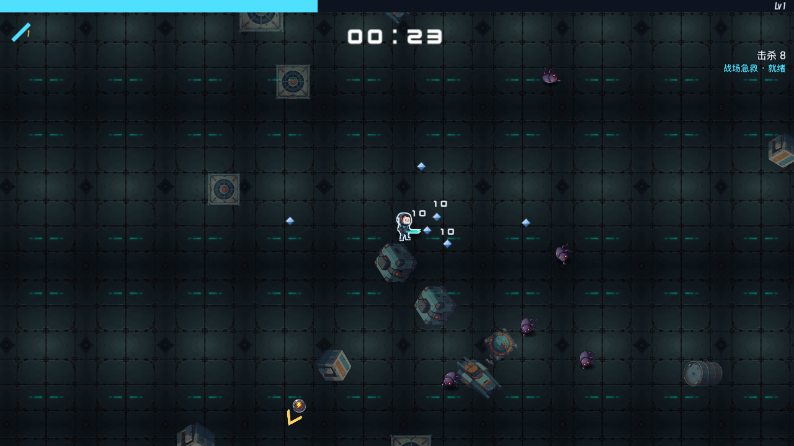

### 2.4 八个角色的前两分钟（station，autopilot 风筝 / 站着不动，各 16 种子）

| 角色 | 起始武器 | 风筝：击杀 | 风筝：等级 | 风筝：首次升级 s | 站着不动：死亡 / 16 | 站着不动：存活 s | 站着不动：击杀 |
|---|---|---|---|---|---|---|---|
| 幸存者 | 等离子刃 | 81 | 4.0 | 54 | 6 | 116 | 176 |
| 陆战队员 | 磁轨炮 | 97 | 3.9 | 38 | 13 | 65 | 87 |
| 系统工程师 | 制导激光 | **198** | 6.1 | 14 | 9 | 103 | 177 |
| 维护单元 M-7 | EMP 力场 | **8** | 1.4 | 117 | 11 | 98 | 132 |
| 领航员 | 轨道无人机 | **1** | 1.0 | 120 | **16** | 50 | 45 |
| 阵地工兵 | 电弧锚桩 | 114 | 4.7 | 27 | **0** | 120 | 189 |
| 熔接工 | 电弧导体 | 155 | 5.4 | 20 | 12 | 98 | 135 |
| 炮长 | 平射炮 | 43 | 2.8 | 70 | 15 | 43 | 42 |

- 维护单元和领航员的武器只打贴身 80/50 px，一个保持距离的玩家两分钟几乎没有经验；而贴身站着又会死（领航员 16/16 在 50 s 内死）。这两个角色标价 1000 / 1200，是新手第二、三个会买的东西，体验却是"我的武器不打人"。
- 阵地工兵站着不动 0 死——锚桩 + 固守叠层对"不会走位"的玩家是最友好的，但它标价 1400。
- 炮长 80 血、只打一侧，站着不动 43 s 就死；它的第一个 25 秒在屏幕上几乎看不到武器（图 22-char-gunner）。

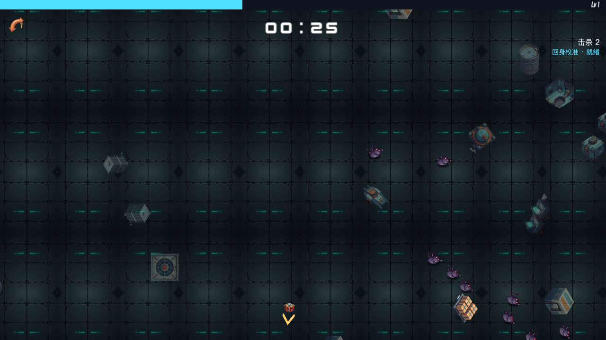

### 2.5 教学与"朝向"规则

- 教学是三页纯文字（图 03），第一页就把"刀双向横扫 / 磁轨炮朝面向射击"说了，但幸存者的刀双向横扫意味着**前五分钟根本不需要转身**；规则要到第二个角色或捡到磁轨炮才有后果。没有任何局内反馈告诉玩家"你背后有一群人而你的炮朝着空处"。
- 刀的横带是水平的，上下方向打不到——这是设计意图（通风爬虫就是为此而生）。但新手看不出刀的命中区：`fx_slash` 画的是弯月，命中是 140×128 的矩形带。

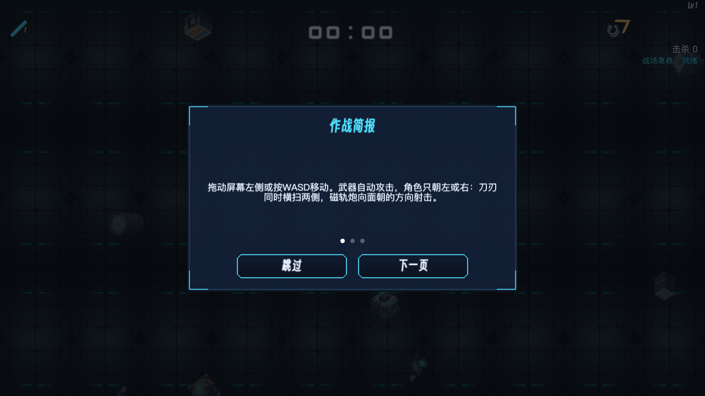

---

## 3. Build 多样性与决策质量

### 3.1 每把武器单独的输出（station 10 分钟人群，60 s，12 种子，不死，growth=0）

两列："站定"是人群压在身上时的输出（接触类武器的本职），"风筝"是 autopilot 带着武器跑时的输出（射程类武器的本职）。

| 武器 | L1 站定 杀/伤害 | L4 站定 | L8 站定 杀 / 伤害 | L8 风筝 杀 / 伤害 | L1→L8 倍数（杀） |
|---|---|---|---|---|---|
| 平射炮 pivot | 204 / 22.5k | 333 / 46.5k | **515 / 68.3k** | **244 / 26.1k** | 2.5× |
| 电弧锚桩 pylon | 248 / 37.6k | 408 / 54.4k | **485 / 67.2k** | 105 / 12.0k | 2.0× |
| 等离子刃 slash | 148 / 24.7k | 255 / 49.2k | 399 / 66.3k | 79 / 4.7k | 2.7× |
| 轨道无人机 orbit | 111 / 11.5k | 189 / 28.2k | 318 / 41.0k | 108 / 6.8k | 2.9× |
| EMP 力场 aura | 96 / 17.3k | 143 / 33.9k | 264 / 53.8k | 74 / 5.1k | 2.8× |
| 磁轨炮 stream | **19 / 1.1k** | 120 / 7.9k | 261 / 16.6k | 68 / 5.7k | 13.7× |
| 制导激光 aimed | 37 / 1.5k | 90 / 4.3k | 185 / 12.7k | 106 / 11.8k | 5.0× |
| 电弧导体 chain | 49 / 2.9k | 146 / 8.3k | 143 / 19.6k | 69 / 3.9k | 2.9× |

| 进化 | L8 站定 杀 / 伤害 | 相对基础 L8（杀 / 伤害） | L8 风筝 杀 |
|---|---|---|---|
| 视界抹除 horizonWipe | **718 / 126k** | 1.39× / 1.85× | **578** |
| 湮灭之刃 annihilationBlade | 656 / 81k | 1.64× / 1.21× | 158 |
| 聚变光矛 fusionLance | 589 / 69k | **3.2× / 5.4×** | **391** |
| 穿甲磁轨 shredderRail | 548 / 50k | 2.1× / 3.0× | 168 |
| 风暴栅格 stormLattice | 512 / 84k | 3.6× / 4.3× | 150 |
| 引力锚阵 graviticLattice | 509 / 80k | **1.05× / 1.18×** | 497 |
| 卫星阵列 satelliteArray | 407 / 62k | 1.28× / 1.50× | 159 |
| 奇点力场 singularityField | 398 / 83k | 1.51× / 1.54× | 81 |

读法：

- 站定时 8 级武器之间差 **4–5 倍**（平射炮 68k vs 激光 12.7k）；进化后被拉平到 400–720 杀。也就是说进化是"把弱武器补齐"而不是"奖励"：弱基础（激光/磁轨/导体）进化翻 3–5 倍，强基础（锚桩/刀/平射炮）只有 1.05–1.6 倍。**引力锚阵在这个人群里比 8 级锚桩多 5% 的击杀**，它的"拖拽"动词在击杀数上几乎不可见。
- 1 级磁轨炮是全游戏最弱的开局：pierce 1、1 发、6.5 伤。陆战队员（600 金币，第一个被买的角色）前两分钟 97 杀还行是因为 autopilot 会转身对准人群；站着不动 13/16 死。
- 激光是唯一"风筝越远越好"的武器（风筝 106 杀 > 刀 79），这合理，也是为什么 bot 的 build 里总是激光。

### 3.2 一局能拿到多少：不死 autopilot 的 15 分钟（station，16 种子）

| 策略 | 结束等级（中位 / 范围） | 击杀 | 补给箱 | 进化局数 | 每局进化数 | 首次进化 s（中位 / 最小） | 升级次数 |
|---|---|---|---|---|---|---|---|
| first（永远选第一张） | 58 / 19–65 | 7,644 | 18 | 16/16 | 3.4 | 480 / 217 | 57 |
| focus（专注起始武器 → 配对被动 → 已有武器） | 60 / 42–67 | 8,415 | 19 | 16/16 | 3.75 | 330 / 153 | 59 |

- 补给箱每局 18 个：5 个哨兵 + 2 个 Boss + 1 个遗物 + ~10 个残骸箱（1 分钟一个的上限几乎每分钟都触发）+ 塌缩区（几乎从不）。按期望 2 级/箱算，**一局约 36 级来自箱子、57 级来自升级**——箱子占 build 的 40%。这是进化能发生的原因，也意味着残骸箱的 60 s 间隔实际上是后期 build 的节拍器。
- focus 策略把首次进化从 8:00 提前到 5:30，最早 2:33（150 s 的哨兵箱开出 5 级）。玩家只要知道"盯着一把武器点"就能在第一个 Boss 前后进化——这个事实应该让玩家知道（暂停页有配方，但升级卡上没有"再 N 级就能进化"的提示，除了满级那张）。

### 3.3 升级 offer 的构成（不死 autopilot first 策略，812 次 offer / 16 局）

| 卡的种类 | 出现次数 | 占卡面 |
|---|---|---|
| 武器升级（weapon_lvl） | 576 | 24% |
| 被动升级（passive_lvl） | 587 | 24% |
| 新被动 | 255 | 10% |
| 新武器 | 240 | 10% |
| **极限突破（limit）** | **720** | **30%** |
| 死卡（当前 build 用不上的被动） | 6 | 0.2% |

- 死卡权重 0.25 的做法有效：812 次 offer 只有 6 次出现死卡。
- 73 次 offer（9%）三张全是被动；416 次（51%）没有任何武器升级可选。
- 第一张极限突破在 **38–44 级**出现（全部 13/16 到达的局）。作者一局到 60 级，意味着**最后 20 次升级全是 "+10% 伤害 / +8% 范围 / −6% 冷却 / +10% 弹速"**——没有选择，只有确认。
- 武器升级表 56 条里改变行为的（+投射物 / +穿透）22 条（39%）：激光 4、磁轨 7、无人机 3、锚桩 2、导体 4、平射炮 2、**刀 0、EMP 0**。等离子刃从 1 级到 8 级只是数字变大。

### 3.4 其他

- 被动 11 个全是单一数值。唯一有"配方"意义的是进化配对，但 8 个配对里 3 个（推进器/弹匣/磁力核心）锁在成就后，另外 3 个新被动（稳定器/散热片/导轨校准）各自只对 1–2 把武器有意义，所以被动槽的后 3 格基本是"随便填"。
- 极限突破的 `LIMIT_AMOUNT` 四项里 `speed` 对刀/EMP/导体无效（`WEAPON_STAT_USE` 里这三类不读 projectileSpeed）——`rollLimitBreak` 只排除了 aura 的 cooldown，没有排除这些。**这是一个小 bug**：刀会被开出 "+10% 弹速" 的极限突破卡。
- 没有可见的武器数值：卡面只写增量，暂停页只写等级和配方，没有 DPS / 射程 / 冷却。Brotato 和 20MTD 都把这个写在脸上。

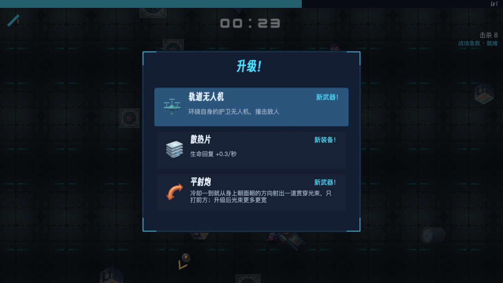
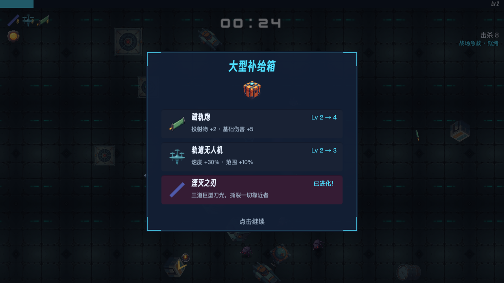

---

## 4. 难度曲线与节奏

### 4.1 数据层面的逐分钟压力

每关每分钟的 `minCount × 加权平均 hp × hpMult`（"场上总血量"，作为压力代理），以及加权平均接触伤害（×dmgMult）：

| 分钟 | station | cargo | lab | orbit | reactor | derelict | foundry | singularity |
|---|---|---|---|---|---|---|---|---|
| 0 | 36 | 118 | 144 | 36 | 36 | 113 | 168 | 128 |
| 1 | 157 | 291 | 273 | 71 | 125 | 266 | 378 | 322 |
| 2 | 309 | 533 | 528 | 148 | 388 | 554 | 548 | 983 |
| 3 | 839 | 1,334 | 1,066 | 304 | 856 | 1,368 | 757 | 1,789 |
| 5 | 1,922 | 5,307 | 1,730 | 995 | 3,310 | 3,631 | 3,063 | 4,363 |
| 6 | **4,979** | 7,050 | 2,772 | 2,043 | 5,144 | 4,632 | 5,962 | 8,767 |
| 9 | 12,427 | 13,350 | 5,153 | **4,154** | 11,092 | 10,017 | 13,568 | 21,381 |
| 10 | 16,997 | 19,183 | 5,592 | **10,510** | 13,746 | 12,312 | 18,269 | 26,982 |
| 11 | 20,384 | 22,894 | 6,547 | **5,431** | 17,014 | 14,713 | 24,089 | 33,424 |
| 12 | 25,322 | 25,655 | 10,383 | **14,044** | 21,110 | 17,945 | 29,525 | 41,133 |
| 14 | 48,400 | 49,124 | 13,206 | 16,733 | 32,561 | 26,239 | 48,467 | 64,695 |

- station 5→6 分钟 ×2.6（机甲 15% 进场），正好压在 5:00 Boss 和 5:30 的 ×2 哨兵之后。bot 的死亡 8/13 集中在第 4–5 分钟。
- orbit 的 9/11/13 分钟是锯齿（机甲隔分钟出现），压力在 4k–10k–5k–14k 之间来回。它的 speedMult 是另一回事，但场上血量的锯齿玩家能感觉到：每隔一分钟突然轻松。
- 后四关第 1–3 分钟是 station 的 1.7–3 倍。singularity 第 0 分钟就有 15% 崩解体（44 hp、9 伤、死后留引力井），bot 的头号死因就是它（contact 1,331）。这些关只有通关前一关的人能进，但从 orbit（第 1 分钟 71）到 reactor（125）再到 derelict（266）、singularity（322）的跳跃，没有和玩家 build 的增长对齐——玩家每局都是 1 级开始。

### 4.2 bot 在八关的死亡分布（autopilot，16 种子）

| 关 | 存活中位 s | 等级中位 | 死亡分钟分布 | 头号死因 | 承伤前三 |
|---|---|---|---|---|---|
| station | 317（均 513） | 13 | m4:4 m5:4 m9:2 m10–13:3 m15:3 | bolt 8/13 | bolt 2,974、机甲 513、哨兵 466 |
| cargo | 321 | 7 | m0–3:6 m5–8:4 m10:3 m12:1 m15:1 清关 1 | 拆解机甲 4 | 机器人 1,209、拆解机甲 973、哨兵 743 |
| lab | 367 | 19 | m4:4 m5:3 m6–7:3 m9–13:6 | bolt 11/16 | bolt 4,149、母巢 460 |
| orbit | 299 | 10 | m3:1 **m4:7 m5:8** | bolt 10、旗舰 5 | bolt 2,231、哨兵 875 |
| reactor | 292 | 7 | **m4:9** m5:5 m6:2 | bolt 12/16 | bolt 1,207、熔渣行者 666 |
| derelict | 171 | 5 | **m2:9** m3–6:7 | 通风爬虫 5、打捞巨臂 4、哨兵 4 | 船员残骸 1,121、通风爬虫 911 |
| foundry | 194 | 5 | m2:5 m3:4 m4:3 m5:3 | bolt 6、哨兵 5 | 毛坯体 1,337、bolt 732 |
| singularity | 172 | 6 | **m2:8 m3:5** m4–5:3 | 崩解体 7 | 崩解体 1,331、牵引者 707 |

- 这些绝对值不是玩家会看到的，但**排序**说明：orbit/reactor 的第 4–5 分钟（旗舰 + 钳制炮机的 bolt）和 derelict/singularity 的第 2 分钟是最硬的墙。orbit 16/16 在 5:00 旗舰处或之前死，bossKills 0.00。
- "哨兵"在 4 关进入承伤前三：它背着箱子走向玩家、几乎不受击退、hpMult 一路到 5.5。bot 与它纠缠而死。对真人它是一个 5–10 s 的目标，但 **×5.5 的哨兵（850 s）对 bot build 120 s 打不死**；对一个 15 分钟时只有 20 级的普通玩家，它也会是半分钟的纠缠。

### 4.3 Boss：是战斗还是减速带（8 种子，不死，autopilot 瞄准）

build 定义：bot@5:00 = L8 刀 4 磁轨 2 核心 1；human@5:00 = L30 刀 8 激光 5 磁轨 4 无人机 3 + 核心 4 冷却 3 放大 2；bot@10:00 = L11；human@10:00 = L60 两把进化 + 三把 5–8 级 + 五个被动；bot@15:00 = L13；human@15:00 = L90 六把全进化 + 六个被动满 + 每把 8 层极限突破。

| 关 | Boss | 血量 bot / human（缩放） | TTK 中位 bot | TTK 中位 human | 备注 |
|---|---|---|---|---|---|
| station 5:00 | 母舰 | 400 / 1,440（×3.6） | 168（3/8 未杀） | **10.8** | |
| station 10:00 | 哨戒炮舰 | 2,184 / 9,828（×4.5） | 260（7/8 未杀） | **23.7** | |
| station 15:00 | 湮灭者 | 6,600 / 23,100（×3.5） | 100（7/8 狂暴） | **10.2** | human 从不狂暴 |
| cargo 5:00 / 10:00 / 15:00 | 运输舰 / 拆解机甲 / 巨神 | | 169 / 175 / 104 | 10.1 / 11.5 / 13.0 | 拆解机甲 human 1/8 未杀（地雷阵） |
| lab | 母巢 / 畸变体 / 虫巢女王 | | 173 / 235 / 45 | 19.6 / 19.0 / **8.1** | 母巢 human 有一局 252 s（被孢子淹没） |
| orbit | 旗舰 / 幽灵 / 虚空母舰 | | 40 / 40 / 61 | 12.4 / 8.3 / 10.1 | |
| reactor | 熔渣巨口 / 齐射炮阵 / 熔毁堆芯 | | 155 / 189 / 76 | 15.7 / 24.6 / 11.0 | |
| derelict | 打捞巨臂 / 锚索绞盘 / 沉眠者 | | 260（8/8 未杀）/ 63 / 95 | **66.5** / 12.3 / 20.3 | 护盾弧是唯一让 human 打超过 1 分钟的机制 |
| foundry | 锻压母机 / 增殖母机 / 熔炉核心 | | 201 / 260 / 149 | 16.0 / 14.5 / 11.6 | |
| singularity | 吸积体 / 潮汐巨舰 / 事件视界 | | 49 / 53 / 39 | 19.5 / 13.4 / **8.8** | |

结论：

- 对 human-like build，**24 个 Boss 里 22 个在 25 s 内死**，8 个终局 Boss 8–20 s。母舰 6 s 一次冲锋、哨戒炮舰 2.6 s 一轮弹幕、巨神 1.2 s 一颗地雷——在 10 s 里这些机制各出现一两次就结束了。90 s 狂暴是给 bot 设计的（bot 7/8 触发），真人永远见不到。
- 唯一例外是打捞巨臂的 160° 护盾弧（正面只吃 30%），它把 human 的 TTK 拉到 66 s——这说明**位置约束比血量更能制造"战斗"**。沉眠者的旋转护盾（0.18 正面）只拉到 20 s，因为 human build 有 5 把全方位武器。
- `bossLevelScale` 的上限 4.5/3.5 在 60/90 级已经顶满；按本文的测量，要让 human 打 40–60 s，10:00 Boss 的血量需要再 ×2–2.5，终局 ×3–4。但单纯加血会让 bot build（也就是普通新手）更打不动——这正是注释里说的两难。解法见建议 S1。

### 4.4 15 分钟里有没有"空档"

- 事件表最大间隔 60–100 s，每关 16–22 个事件，密度足够。
- 不死 autopilot 每分钟承伤（station，first）：1/6/34/51/92/123/72/59/69/96/**278**/67/66/71/61。第 11 分钟的尖峰是哨戒炮舰的弹幕 + 660 s 的机器人包围；**12–15 分钟对一个会走位的玩家反而是全场最平静的四分钟**（承伤 ≈ 第 7 分钟），因为 build 已经碾压。真正的"后期压力"来自 hound（215 px/s）和 encircle，但 hound 只占 12–15%。
- 第 2 分钟（collapse 120 s）与第 2:30（哨兵）、3:30（无人机潮）之间是前段最空的一段。

### 4.5 八关是不是换皮

| 关 | 敌人种类 | 独有敌人 | 与其他关共享比例 | 行为类型 | 障碍物 |
|---|---|---|---|---|---|
| station | 14 | 3（全是 Boss） | 79% | chase bomber ranged dasher healer boss | 0 |
| cargo | 12 | 4 | 67% | + tractor | 12 |
| lab | 11 | 6 | 45% | + nest | 0 |
| orbit | 14 | 6 | 57% | + layer blink prop | 0 |
| reactor | 16 | 7 | 56% | + suppressor mortar | 0 |
| derelict | 14 | 8 | 43% | + flanker bulwark tether | 14 |
| foundry | 14 | 9 | 36% | + scavenger bulwark nest | 6 |
| singularity | 19 | 8 | 58% | + tractor tether blink | 0 |

不是换皮：后四关各带 2–3 种新行为，derelict 和 foundry 的敌人大半是本关独有。问题在**第 1 关**：station 的 11 个普通敌人全是别处也有的，它自己只有三个 Boss 是独有的——而 station 是 100% 玩家都会反复玩的那一关。塌缩区本来是它的身份，但见 §5。

---

## 5. 塌缩区（station 独有）

### 5.1 几何与时间

- 48 次画圈（16 种子 × 3）：圆心离玩家 250–360 px（中位 360，被 `placeInView` 的短轴夹到 250 的占 1/4）；进圈拿箱再出圈至少 (dist+radius)/200 = **2.1–2.7 s**；警告 **9 s**。
- 圈的半径 170，圆心最远只到视野边缘内 110，所以圆的上/下 1/3 经常画在屏幕外（图 09b 左上角）。

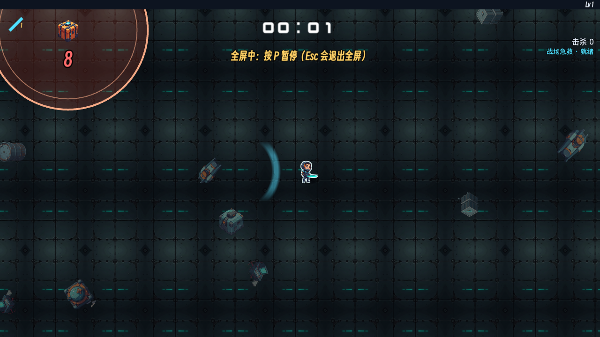

### 5.2 五种策略 × 48 次塌缩（不死）

| 策略 | 拿到箱子 | 箱子被埋 | 玩家被埋（受伤） | 拿到用时 s |
|---|---|---|---|---|
| autopilot（风筝，避开圈） | 2 | 46 | 0 | 1.7 |
| 随机游走 | 3 | 45 | 3 | 1.4 |
| 绕圈 | 4 | 44 | 5 | 1.5 |
| 站着不动 | 0 | 48 | 0 | – |
| **看见就冲（diver）** | **48** | 0 | **0** | **1.4**（最大 1.6） |

- 一个决定去拿的人**100% 拿到、0% 受伤、还剩 7 s**。一个不去的人几乎不会被埋（0–10%）。两种选择都没有代价，于是它不是决策，是"要不要走三步"。
- 奖励是 `standard` 箱：1 级 60%、3 级 32%、5 级 8%，期望 1.96 级（幸运 1.5 时 2.30）；Boss 箱期望 3.50。比起哨兵（要打 160×n 血、要承受它的接近），塌缩箱是全场最便宜的箱子，却也最容易被忽视——因为它不会像其他所有箱子一样飞向玩家。
- 塌缩吞掉圈内普通敌人、不计击杀——这个"把人群引进去"的用法在 48×5 次测量里没有一次被任何策略用上；真人可能会，但圈在 9 s 后才塌，而人群 2–3 s 就跟上来了，引进去等于自己也在里面。
- 遥测注意：autopilot 没有"去拿"的项（`PRIZE_W` 只认背箱子的敌人），所以 `balance.test.ts` 和任何 bot 实验都会报告"没人拿"，而且 `collapse` 事件的 `taken=false` 会在 bot 和真人之间无法区分原因。

### 5.3 判断

- 9 s 不对；按 2.5 s 往返 + 1.5 s 反应，**5–6 s** 才有"来不来得及"的张力。
- 要让它成为决策，需要让"进去"有代价或让"不进去"有损失：圈里是人群最想去的地方（箱子吸引敌人）、晚拿的箱子更大、或者圈会向玩家扩张。
- 在这些成立之前不建议扩到其他关；但机制本身（关于地面而非敌人）是这游戏名字的来源，值得修到能用。见建议 S3。

---

## 6. 手感与反馈

### 6.1 看到的

| 时刻 | 评价 | 图 |
|---|---|---|
| 菜单 / 出击页 | 清楚，八角色八关一屏可见、价格明示、挑战符说明到位 | 01、02 |
| 开局 0–30 s | 空。12 个敌人、首杀要等几秒，首次升级 20–30 s | 05 |
| 命中 / 击杀 | 伤害数字（上限 24 个）、死亡粒子、刀光残影；没有 hit-stop、没有击杀时的敌人形变；大击退只在 ≥400 hp 的身上触发震屏 | 13c |
| 升级 | 全屏青色闪 + 250 ms 后面板，有"为什么时间停了"的节拍，好 | 06 |
| 补给箱 / 进化 | 揭示面板按行落下、进化行变色，好；但它是全局最常出现的面板（一局 18 次）且必须点击继续 | 07、08 |
| Boss 登场 | toast + 震屏 + 底部血条 + 音乐换 mood，到位；但 **Boss 从视野边缘走进来时没有方向指示**，玩家看到的只有血条 | 11b |
| Boss 击杀 | 白闪 + 650 ms 慢动作 + 震屏——全游戏最好的一个瞬间，而它只持续 10 s 的战斗 | 12 |
| 塌缩 | 圈 + 倒计时 + 箱子，可读；塌陷时的闪光与吞噬动画没有问题 | 09b |
| 后期 | 270 敌人 / 290 宝石 / 17 投射物时仍能分辨自己、宝石和机甲群；伤害数字被上限压住，正确 | 13c |
| 死亡 | **没有瞬间**：同一帧切结果页 | – |
| 结果页 | 信息全（时间/等级/击杀/金币/成就/build/武器伤害占比）；没有"死于什么"、没有分数、没有与上次的比较 | 17、18 |
| 暂停页 | 进化配方 + 属性 + 专属能力说明，同类里少见的好 | 16 |

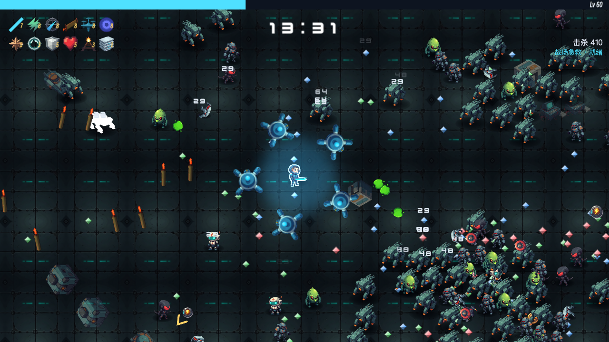
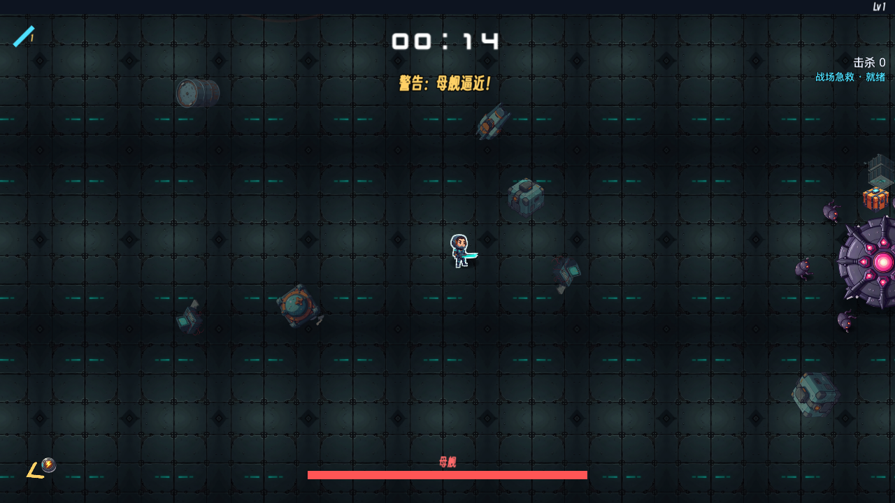

### 6.2 感受层面的缺口

- **死亡没有节拍**。建议至少 600–800 ms 的慢动作 + 角色倒下 + 结果页写"击杀者：酸液喷吐者"（`hurt` 事件已经带 `id`）。
- **没有 hit-stop / 命中形变**。`anim.ts` 有 hit squash 用于玩家受击；敌人受击只有 80 ms 白闪。对于一款靠"刀光扫过去一排敌人弹开"的游戏，这是最便宜的手感提升。
- 哨兵（背箱子）和冲锋潮没有任何登场提示（代码里 `elite`/`rush` 在 visual 分支缺席）。1:30 的 25 架拦截机横穿屏幕，对新手是一堵突然出现的墙。
- toast 只有一个槽，后到的覆盖先到的（图 09b 里全屏提示盖掉了塌缩警告）。

### 6.3 音频（按事件核对，未用耳朵）

- `pumpEvents` 的 visual 分支：hurt/death/shot/hit/boss/final/enrage/evolve/bossKilled/explode/shield/signature/collapseWarn/collapse/telegraph/enemyShot/heal/pickup/nuke/vacuum 都有对应 sfx；`levelUp` 在 `openLevelUp` 里播。
- **没有声音的**：`gem`（`SFX_KEYS` 里有 'gem' 却从未被播放——VS 的宝石叮当声是节奏感的一半）、`elite`、`rush`、`chest` 捡起（面板里有）。
- **音乐**：`?debug=1` 真实音频下，经 hook `startRun` 开局后 10 s 内 mood 一直是 `menu`，Boss 登场后切 `boss`；查代码确认只有 `LaunchScene` 设 `battle`，**`ResultsScene.retry` 不设**——"再来一局"的整局前 5 分钟放菜单曲。Boss 死后切回 `battle` 是对的。
- 真实音频下 `activeSounds` 采样 0–3，sfx 总线 cap 16 没有被打满。

### 6.4 手机布局

- 竖屏 iPhone 14 视野 542×922，可玩；升级卡在竖屏下变成大按钮，好（图 33）。
- **Bug**：触屏设备上暂停按钮（`top+130`，72×56）压在专属能力文字（`top+98`）上，横竖屏都如此；而且按钮里看不到暂停图标（图 36b / 36c / 36d）。
- 横屏 Pixel 7 视野 1199×500：上下 250 px 的可视范围里，刀的水平带和"上下打不到"的弱点被放大，这关系到平衡而不只是布局（§4 的 densityScale 按面积补了敌人数，但没有补形状）。

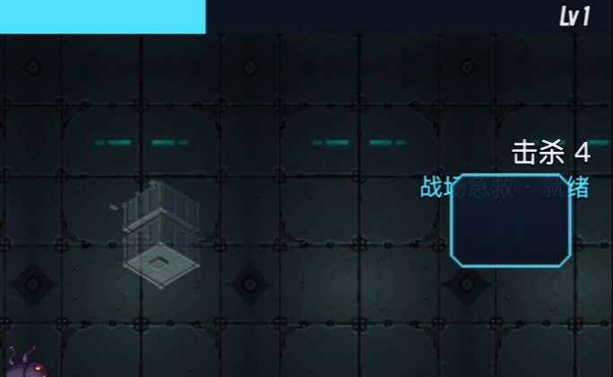
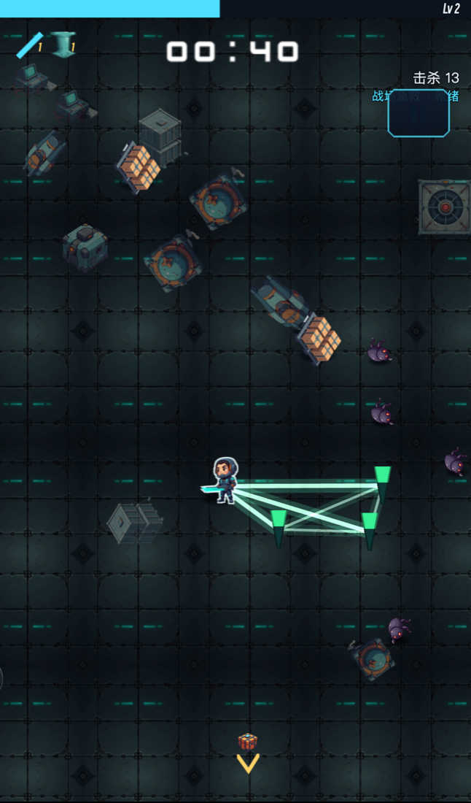

---

## 7. 元循环

### 7.1 收入

- bot 16 局连续折进一个存档（含成就）：第 1 局后银行 330（含 firstBlood 50 + firstEvolution 200——bot 第一局就开出了进化），第 2 局 410，第 3 局（612 s）1,310，第 11 局 2,450；第 12 局一次通关 +1,670 金币 + 4 个成就 → 5,220。
- 金币/击杀 0.149（名义 2%×10=0.2，差额是地面上限 24、未走过去、幸运）。不死 autopilot 通关一局：1,170–1,990 金币 = 硬币 630–1,030 + 补给箱安慰金 240–720（build 满了之后每箱 120）+ 终局 300。
- 推算真人：第一局死在 5–8 分钟（300–800 杀）≈ 50–120 金币 + 成就 150 → **约 200–250**，能买一级船体/磁力线圈；陆战队员 600 ≈ 3–5 局早死或 1 次通关；8 个角色共 8,100；升级舱全满 20,160；合计约 28,000 ≈ 40–60 局。长度合适，不算贵。
- 残骸箱安慰金是后期最大的金币来源之一（一局 2–6 次×120），这其实是在说"满 build 之后箱子没东西给了"。

### 7.2 成就与解锁

- 24 个成就里 3 个解锁被动、其余给金币；10 分钟/两个 Boss/50 级分别解锁推进器/弹匣/磁力核心。真人大概第 2–5 局就全部解锁，之后成就只是金币。
- 关卡链是唯一的"下一个目标"。角色没有专属成就（陆战队员 5 分钟、维护单元通关两个除外）、没有每角色的解锁物（比如"用炮长通关解锁某个被动"），关卡没有"二周目"修饰（挑战符只是 +%）。
- 结果页和出击页都没有"分数"的概念（itch 玩家会截图晒的是一个数字）。`launch.best` 只显示时间。

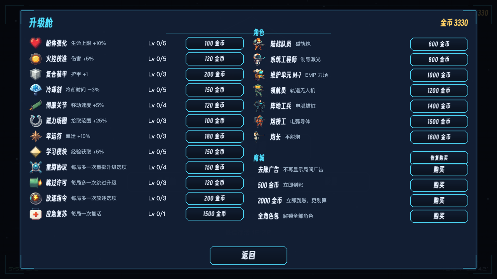

---

## 8. 类型对标：它缺什么、什么适合它

| 机制 | VS | Brotato | 20MTD | 塌缩带 | 适不适合这游戏 |
|---|---|---|---|---|---|
| 进化 / 配方 | 有 | 无（合成） | 无 | **有**，且箱子机制让它可达 | 已经是强项 |
| 1/3/5 宝箱节拍 | 有 | – | – | **有** | 同上 |
| 可见武器数值 | 有（详细） | 有（DPS 面板） | 有 | **无** | 适合，S 级工作量 |
| 改变行为的升级（弹跳/分裂/燃烧/穿透树） | 少 | 有（物品） | **核心**（每武器升级树） | 只有 +投射物/+穿透；极限突破全数值 | **最适合**，且和"朝向"规则天然相容——见 S2 |
| 局前规则修饰（Arcana / 符文 / 诅咒物） | Arcana | 角色负面词条 | 符文 | 只有 +% 诅咒 | 适合：按关卡主题做"协议"（塌缩加剧、无磁力、只朝一侧…） |
| 局内商店 / 货币 | 无 | 有 | 无 | 无 | 不适合（15 分钟连续战斗） |
| 分数 / 排行 | 有金币榜 | 有 | 有 | 无 | 适合 itch：一个可以晒的数字 |
| 死因 / 复盘 | 有（击杀者） | 有 | 有 | 无 | 适合，S 级 |
| 位置性 Boss（护盾弧、安全区） | 少 | 少 | 有 | **有雏形**（护盾/旋转臂/潮汐），但 Boss 10 s 就死 | 已有骨架，缺的是让它活到机制出现 |

和"朝向只有左右"这个身份最契合、而目前没有的一件事：**转身本身没有任何回报或代价**。炮长的"回身校准"证明这个方向成立——把它一般化（转身瞬间的短无敌/冲刺，或所有侧向武器在转身后的第一发加成）会让"一次刻意的按键"真的像一个动作。

---

## 9. 建议清单（按优先级）

标注：【Bug】= 明确缺陷；【设计】= 评估者的设计意见。工作量 S < 半天，M = 1–3 天，L = 一周以上。

### S1 让 Boss 活到自己的机制出现【设计 · 影响最高】
- **改什么**：`src/data/bossScaling.ts` + `src/core/enemies/bossScale.ts` + `eventSystem.ts`。把血量缩放从"等级"换成"最近 60 s 的实测 DPS"：`Simulation` 已经有 `run.damageBySlot`，加一个滑动窗口 `recentDps`，Boss 血量 = `max(authored, recentDps × targetSeconds)`，`targetSeconds` 5:00 = 25 s、10:00 = 40 s、15:00 = 60 s（狂暴 90 s 才有意义）。保留 `authored` 下限，新手不受影响。
- **为什么**：human-like build 全部 Boss 8–25 s 死，机制只出现 1–2 次；bot 100–260 s。等级不是 DPS 的好代理（同是 60 级，first 和 focus 策略 build 的输出差一倍）。
- **效果**：每场 Boss 固定是 25–60 s 的战斗，不论 build；终局狂暴成为真实威胁。
- **工作量** M；**风险**：中——需要防止 DPS 窗口被刚开的箱子抬高；用 `balance.test.ts` 和 §4.3 的 TTK 表（8 种子）复测。补充：给打捞巨臂式的护盾弧更多出场（它是唯一把 human 拖到 66 s 的机制），比加血更能造"战斗"。

### S2 把极限突破变成"动词"卡【设计 · 作者点名要的方向】
- **改什么**：`src/core/levelup/roll.ts` 的 `rollLimitBreak`、`src/core/sim/runState.ts` 的 `LimitStat`、`WeaponInstance.limit`，以及每个 `behaviors/*.ts` 读一个 `verbs` 位图。40 级后（或 build 满后）的卡从四个 +% 改成每个原型一张"动词"卡，可重复叠：
  - 等离子刃 slash「回旋」：刀光 250 ms 后原路返回再判定一次（50% 伤害）；叠层加返回次数。改 `slash.ts` 的 `onVolleyShot` 多生成一个延迟的 slash projectile。
  - 磁轨炮 stream「跳弹」：弹丸用完穿透后向 120 px 内最近敌人折返一次。改 `projectileSystem.resolveBolt`：`pierce<0` 时查 `nearestEnemy` 重设 vx/vy。
  - 制导激光 aimed「分裂」：击杀时分裂成两枚 50% 的子弹。
  - 轨道无人机 orbit「殉爆」：无人机到期时在原地爆炸（半径 80、2× 伤害）——给了"持续时间"一个新意义。
  - EMP aura「脉冲」：每 4 s 把场内敌人向内拉 60 px——和导体/刀的横带形成配合。
  - 电弧锚桩 pylon「接地」：每根桩额外向 120 px 内最近敌人拉一道弧（栅栏伸进人群）。
  - 电弧导体 chain「残留」：最后一跳留下一个 2 s 的标记，再次被任意武器命中时爆 3× 伤害。
  - 平射炮 pivot「回波」：光束打出后 300 ms 向**背后**再打一道 50% 的——它是唯一一张故意削弱"朝向"的卡，放在 40 级后作为奖励是合适的。
- **为什么**：§3.3——作者一局最后 20 次升级是 +10%；56 条武器升级 61% 纯数值。
- **效果**：后期每次升级重新成为"我的武器会怎么变"的选择；进化之后仍有可期待的东西。
- **工作量** L（8 个行为各半天 + 卡面 + 测试）；**风险**：平衡与性能（分裂/跳弹会增加投射物数，`PROJECTILE_CAP 512` 要复测）。可以先做 3 张验证。
- 顺手修的小 bug：`rollLimitBreak` 没有按 `WEAPON_STAT_USE` 排除 `speed`，刀/EMP/导体会开出无效的 "+10% 弹速"。【Bug · S】

### S3 把塌缩区做成决策【设计】
- **改什么**：`src/data/stages.ts` 的 `COLLAPSE`：`warnMs 9000 → 5500`；`reward` 按剩余时间分级（`collapseSystem.stepCollapses` 在拾取时读 `leftMs`：>3 s 普通箱、≤3 s Boss 箱——"越晚拿越大"）；圈心改为吸引 `chase` 类敌人（`chaseStep` 目标在圈存在时偏向圈心，权重 0.3），让圈里有人、也让"把人群引进去"真的发生。`autopilot.ts` 加一项 `CACHE_W`，否则遥测和平衡基线永远是"没人拿"。
- **为什么**：§5——diver 48/48 拿到、0 受伤、余 7 s；不拿的人 0–10% 被埋；期望 1.96 级。
- **效果**：9 s 的"散步"变成 5 s 的"值不值得"；塌缩区成为 station 的身份，再考虑扩到 reactor/singularity（主题吻合）。
- **工作量** S–M；**风险**：低——事件只在 station，`collapse.test.ts` 要改数字。

### S4 起始武器的地板【平衡】
- **改什么**：`src/data/weapons.ts`：磁轨炮 base `amount 1 → 2` 或 `pierce 1 → 2`（1 级 19 杀 vs 锚桩 248）；制导激光 base `cooldown 1200 → 1000`。平射炮/锚桩不动（它们属于 80 血 / 慢速角色）。
- **为什么**：§3.1，8 级站定差 4–5 倍；陆战队员是第一个被买的角色。
- **效果**：两个最弱开局接近中位；进化后的拉平效应保留。
- **工作量** S；**风险**：中——用 §3.1 的方法（12 种子、10 分钟人群、60 s）复测，并跑 `balance.test.ts` 16 种子。

### S5 维护单元与领航员的"风筝也有产出"【设计】
- **改什么**：`orbit.ts`：无人机在 120 px 内有敌人时向其倾斜轨道（`orbitRadius` 临时 ×1.6 朝目标方向）；`aura.ts`：每 3 s 一次把 160 px 内敌人向内拉 40 px（和 S2 的「脉冲」同源，可以直接做成基础行为）。或者至少把这两个角色的 `levelBonuses` 改成 `magnet`，并在角色描述里写"贴身武器，别跑太远"。
- **为什么**：§2.4，两分钟 8 杀 / 1 杀。
- **工作量** S–M；**风险**：低。

### S6 死亡的节拍与死因【设计 · S】
- `GameScene`：`run.phase === 'ended' && died` 时先 `slowMotion(700)` + 角色倒下动画 + 700 ms 后再 `finishRun`；`ResultsData` 加 `killedBy`（最后一次 `hurt` 的 `id`，`enemyName()` 已有），结果页显示"击杀者"。遥测 `run_end` 顺手带上。
- **效果**：新手知道该躲什么；死亡不再像崩溃。

### S7 喷吐者 / 护航艇 / 钳制炮机的前摇【设计 · S】
- `ranged.ts`：`aiTimer2 < 300` 时 `e.flashMs = 40`（和突袭者一样的白闪），或放一个 `telegraph` 事件让 view 画瞄准线。**bolt 是 4 关头号死因且没有任何提示**。

### S8 手机 HUD 重叠【Bug · S】
- `HudScene.ts`：`signatureText` 移到 `top+76` 的击杀数下一行左侧，或暂停按钮移到 `top+60`；检查 `icon_pause` 为什么不显示（按钮渲染为空框）。覆盖 `tests/e2e/mobile.spec.ts`。

### S9 音频与提示的缺口【Bug · S】
- `ResultsScene.retry` 加 `music.setMood('battle')`（和 `LaunchScene` 一致）。
- `pumpEvents`：`elite` → toast "哨兵来了" + `sfx 'boss'`（短）；`rush` → 屏幕边缘方向指示 + 一声；`gem` → 'gem' 音效（已在 `SFX_KEYS`，带音高递增更好）。
- HUD toast 改成两槽队列，优先级高的（塌缩/Boss）不被全屏提示覆盖。

### S10 关卡开局的台阶【平衡 · M】
- `stages.ts`：singularity 第 0–1 分钟去掉崩解体（第 2 分钟再进）；derelict 第 0 分钟 `crewHusk 0.3 → 0.15`；foundry 第 0 分钟 `blank 1.0` 保持但 `minCount 12 → 10`；orbit 9/11/13 分钟补 `mech 0.1` 消掉锯齿；station 第 6 分钟 `mech 0.15 → 0.08`、第 7 分钟再到 0.2（把 ×2.6 拆成两步）。
- **为什么**：§4.1 表；bot 在后三关 2–3 分钟死，station 4–5 分钟死。
- **风险**：中，`balance.test.ts` 与 `newStages.test.ts` 要复测；这些关只有通关前关的人能进，可以保守。

### S11 前 60 秒与"朝向"的教学【设计 · S–M】
- `stages.ts` station 第 0 分钟 `minCount 12 → 16`、`interval 1500 → 1100`；开局在玩家两侧 300 px 各放 3 架无人机（`Simulation` 构造时 `spawnRing`），让第一刀就有东西挨。
- 用一个局内提示替代教学第一页的一半文字：第一次拿到侧向武器（磁轨炮/平射炮）且连续 5 s 背后 200 px 内敌人多于前方时，在角色身边画一个"←转身"箭头 2 s（view 侧，读 `countInArc` 的同类计算）。
- 残骸箱加 `minIntervalMs` 之外的 `notBeforeMs: 45000`，开局 45 s 内不弹面板。

### S12 让"回来"有理由【设计 · L】
- 局前「协议」（arcana）：出击页第三栏，成就解锁，每局选 1 个改变规则的词条，例如「塌缩加剧」（每关都有塌缩区，奖励 ×1.5）、「单向火控」（所有武器只朝面向一侧、伤害 +40%）、「无磁力」（宝石不吸附、经验 ×1.3）、「回身冲刺」（转身获得 0.15 s 无敌 + 40 px 位移，2 s 冷却）。最后一条值得考虑直接做成基础机制：它是"朝向只有左右"这条规则第一次给玩家正反馈。
- 结果页加分数（时间 × 等级 × 击杀的简单公式）与本关最佳对比；出击页关卡 tile 显示最佳分数。
- 升级舱加卡面数值（DPS/射程/冷却）与被动的"对当前最佳 build 的影响"，S 级。

### S13 补给箱安慰金 → 动词卡【设计 · S，依赖 S2】
- `openChest` 的 `rewards.length === 0 && evolved.length === 0` 分支改为发一张 S2 的动词卡，而不是 120 金币。不死 autopilot 一局 2–6 次这种箱子。

---

## 10. 附录：方法

- 所有模拟用 `new Simulation({ seed, characterId, stageId })` 直接步进，事件环每 tick 读后清空（`world.events.clear()`，否则 4096 条后丢弃）。"不死"= `setStatOverride('maxHealth', 1e6)`（保留 `hurt` 事件），武器单测另加 `growth 0`。
- 单武器测量：`setTime(600)`，先无武器跑 30 s 让人群成形，再 `giveWeapon(id, level)`，统计 60 s 的 `run.kills` 增量与 `damageBySlot[0]`；"站定"= 不输入，"风筝"= autopilot。
- Boss TTK：build 装好 → `setLevel` → `setTime(at−20)` → 步进到 `bossSpawned`，到 `bossKilled`/`survived` 的秒数；260 s 上限计为未杀。
- 塌缩：读取 `collapseWarn`（几何）与 `collapseResult`（`n=1` 箱子未被拿、`big` 玩家在圈内）；diver 策略在 `onTick` 里直接朝 `riftCache` 走、拿到后背离圆心。
- 元循环：16 局 bot 结果依次 `commitRun` + `awardAchievements` 进 `MemoryStorage`。
- 截图：`npm run build` + `vite preview --port 4173`，Chromium `--use-angle=metal`（`renderer: Apple M4`，60 fps），`?test=1&lang=zh-CN`；注意 `__game.step()` 走 `pumpEvents(false)`，toast/音效不会播放，含 toast 的截图是用 `resume()` 实时跑出来的。
- 没测的：真实手指在虚拟摇杆上的走位质量；真人对 S2/S3 的主观反应；跨架构确定性（已知不保证）。
